# NCHU_HELP

### Description
The full name of the project is NCHU Campus Gang, which is developed based on the background of Nanchang Hangkong University's online service

#### Functional modules
1. Campus Market
2. Campus Forum
3. Lost & Found
4. Campus errands

##### Diagram of the functional modules of the project
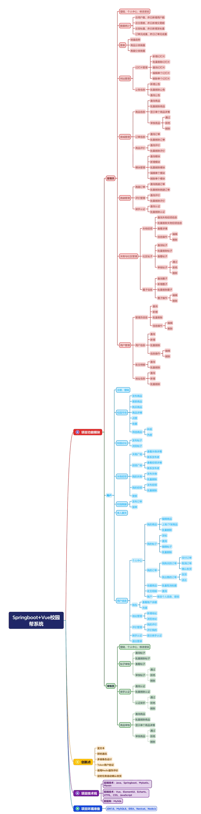

##### Project architecture diagram
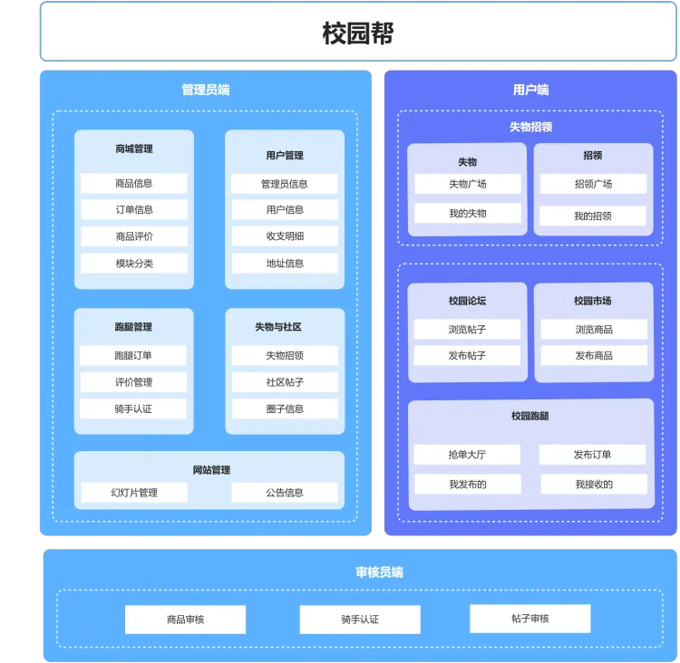

#### Roles
1. Administrators
2. Auditors
3. Users
4. Rider (User Application)

#### Screenshot of the project section
##### Sign up for the login screen

##### Admin side
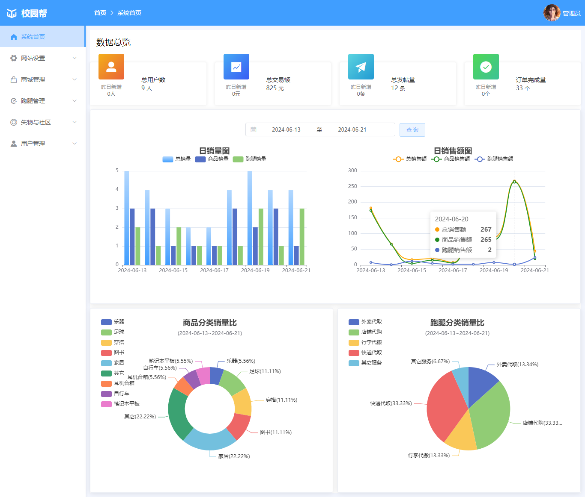
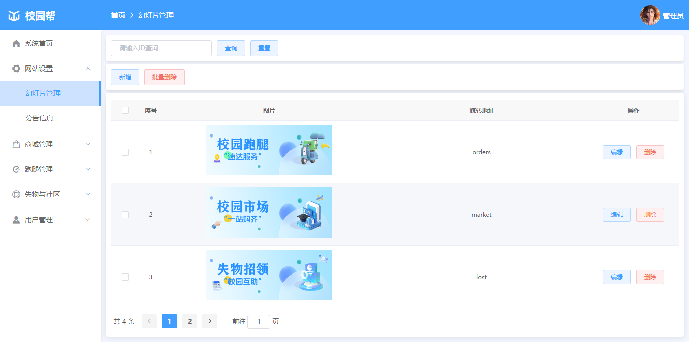
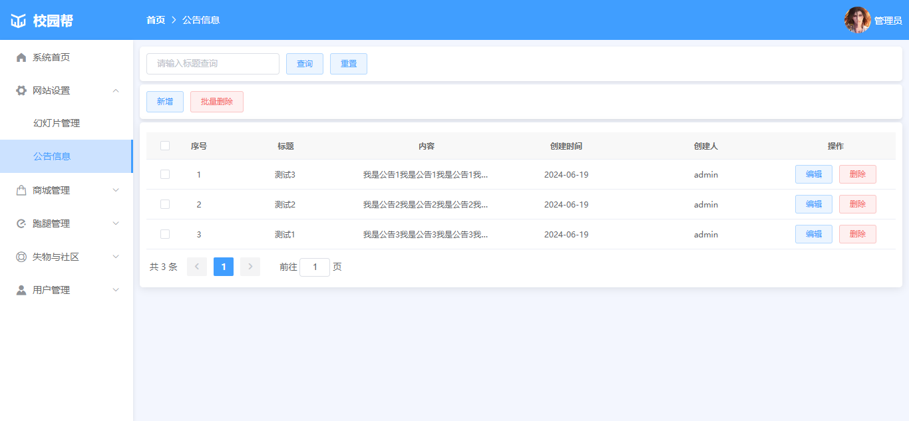
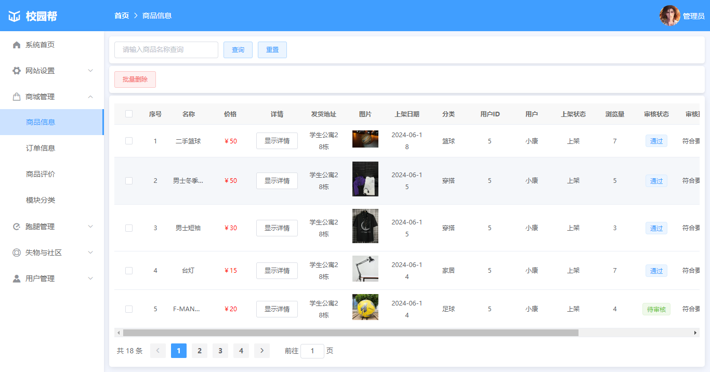
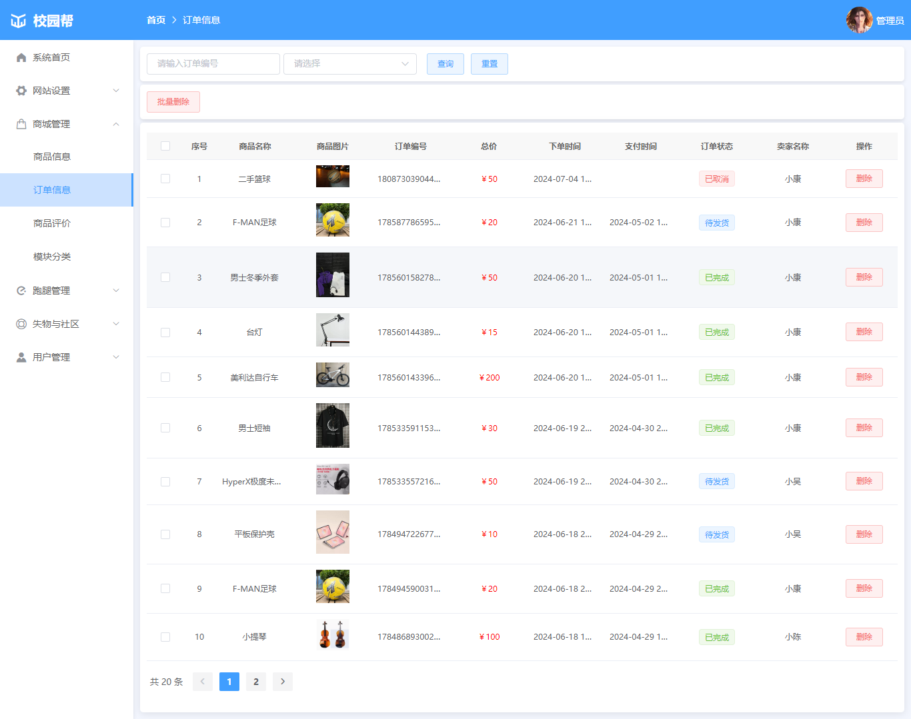
##### Client

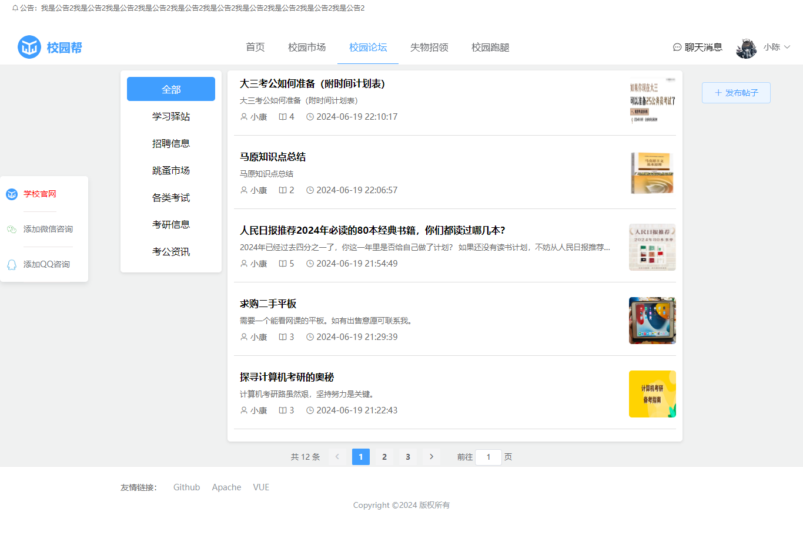
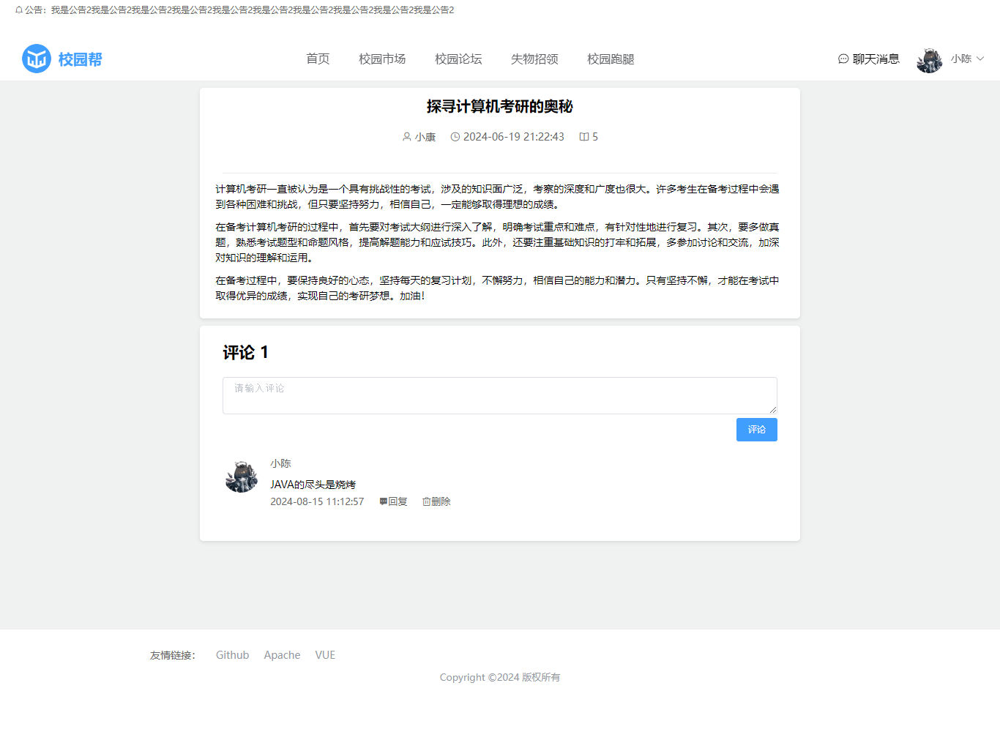

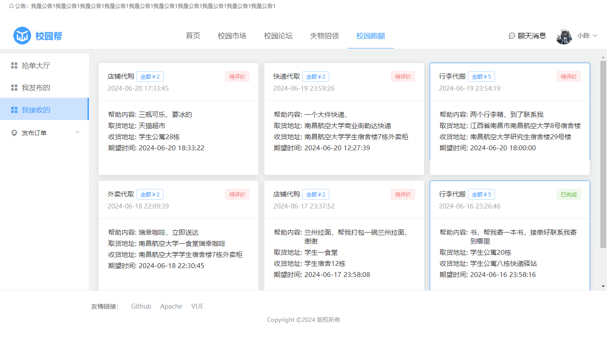

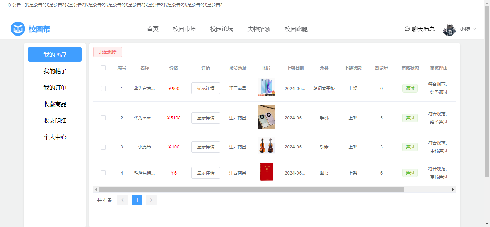
##### Auditor's end
I don't want to intercept it, so I look at it myself, it's similar to the administrator's side

##### Register for the login screen

This project is completely free and open-source, helping you to complete the design and learning, and prohibits reselling!!
#### Software Architecture
The project designs the following technologies:
#### back end
Springboot
mybatis

#### Front
VUE
Element-ui

#### Middleware
redis
### Installation

1. Download the full source code for this project
2. Import the project and configure the database
3. Modify the profile information
4. Start Redis service (comments will not be loaded if not enabled, other functions are normal)
5. The run was successful

### Instructions

1. The project is simple, nothing to say
2. If you find any problems with the project, you can contact me
3. The project can be deployed to the server normally

### Contact
If you have any questions, you can contact me
#### QQ

#### Wechat
