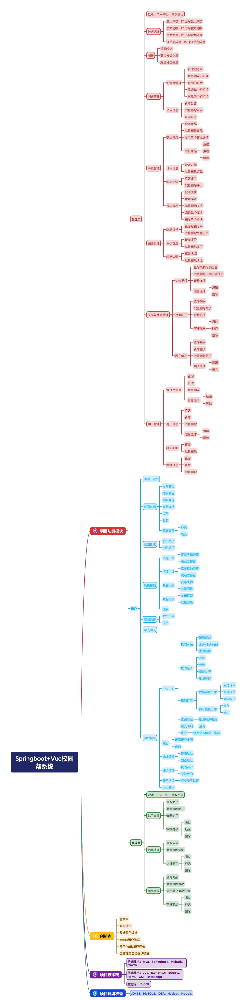
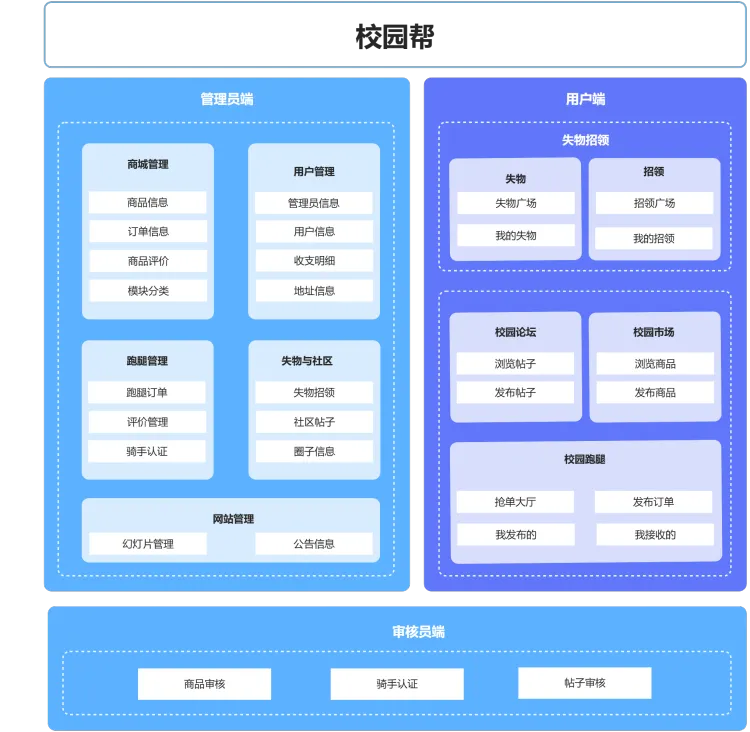
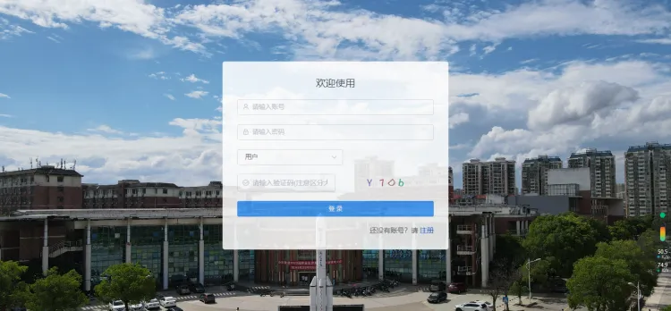
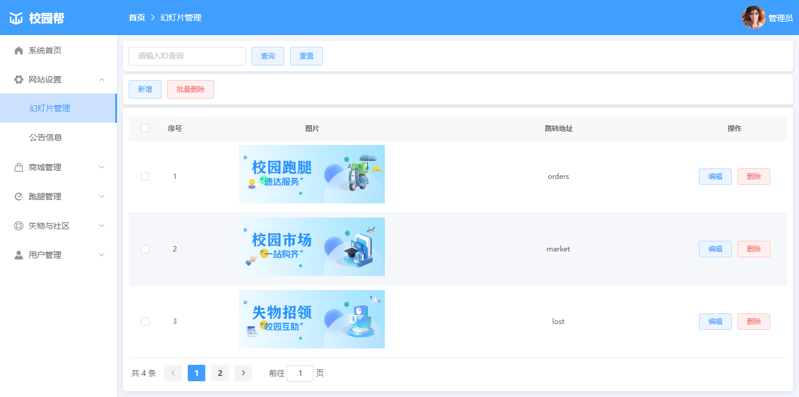
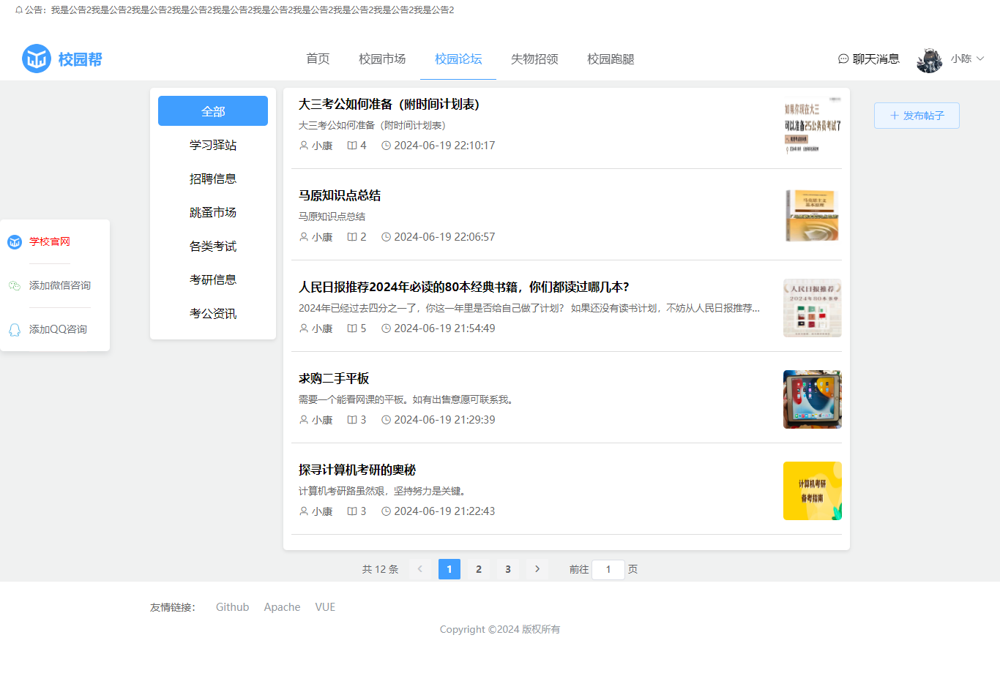
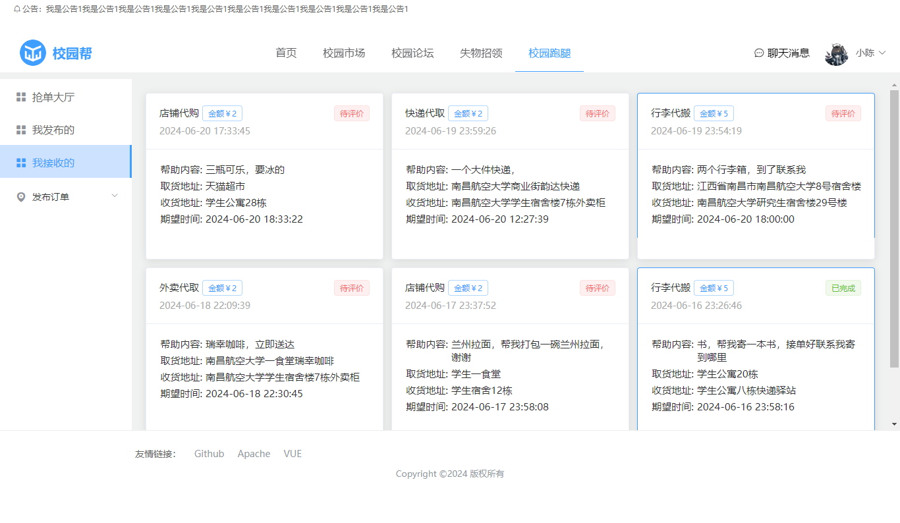
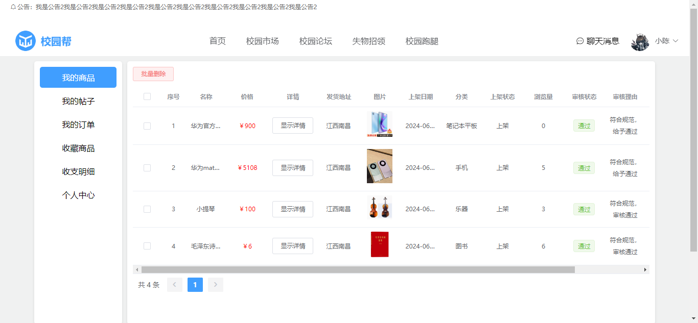

# NCHU_HELP

### 介绍

该项目完整名称为NCHU校园帮，是基于南昌航空大学的线上办事这一背景开发的

#### 功能模块：
校园市场
校园论坛
失物招领
校园跑腿

##### 项目功能模块图

##### 项目架构图

#### 角色
1. 管理员
2. 审核员
3. 用户
4. 骑手（用户申请）

#### 项目部分截图
##### 注册登录界面

##### 管理员端

##### 用户端

##### 审核员端
不想截了，自己去看，跟管理员端差不多

本项目完全免费开源，助力各位完成毕设和学习，禁止倒卖出售！！！

### 软件架构
项目设计以下技术：
#### 后端
Springboot
mybatis

#### 前端
VUE
Element-ui

#### 中间件
redis

### 安装教程

1. 下载本项目的完整源码
2. 导入工程，配置数据库
3. 修改配置文件信息
4. 启动redis服务（不启用评论不会加载，其他功能正常）
5. 运行成功

### 使用说明

1. 项目简单，没什么说明的
2. 如果发现项目上有任何问题可以联系我
3. 项目能正常部署到服务器

### 联系方式
有任何问题可以联系我
#### QQ

#### 微信

